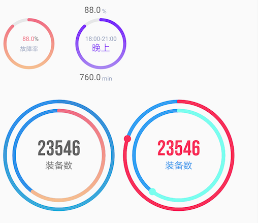
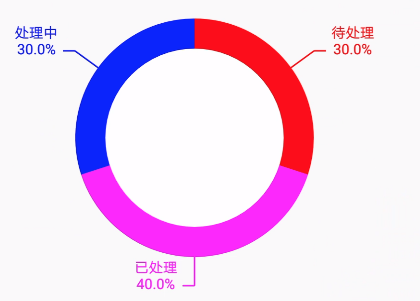

# 图表组件库[](https://jitpack.io/#com.gitee.eachann_lee/charts)
### How to
1.Add the JitPack repository to your build file
```
allprojects {
		repositories {
			...
			maven { url 'https://jitpack.io' }
		}
	}
```
2.Add the dependency
```
dependencies {
	        implementation 'com.gitee.eachann_lee:charts:1.1.7'
	}
```

### 效果图

#### 柱状图+折线图

#### 空心圆渐变图

#### 半圆仪表盘

#### 速率仪表盘

#### 矩形渐变

#### 横向渐变柱状图

#### 甜甜圈


#### 曲线图

#### 自动计算文字宽度,自适应换行
